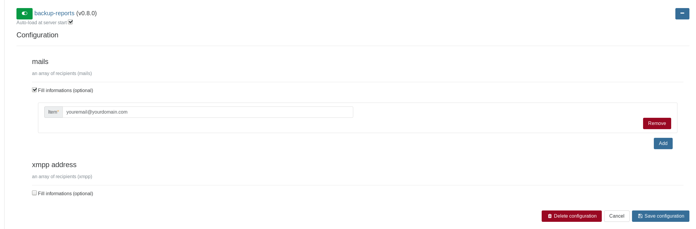
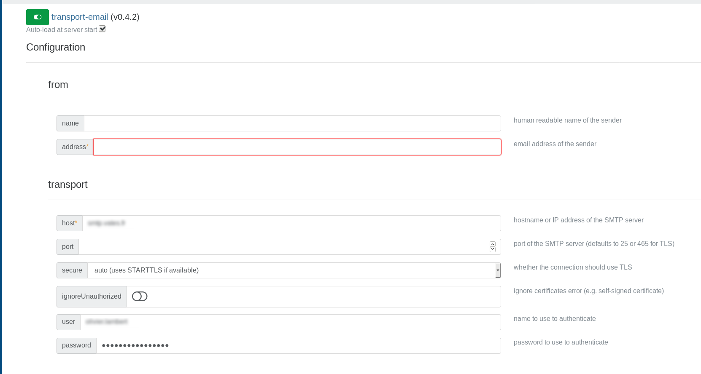
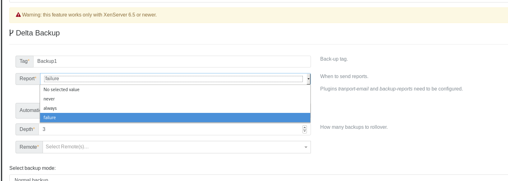

# How to configure backup reports

At the end of a backup Job, you can configure Xen Orchestra in order to receive a backup reports directly on your an email of your choice.

### Step-by-step

1. On the "settings/plugins" view you have to activate and configure the "Backup-reports" plugin. 

2. Still on the plugins view, you also have to configure the "transport-email" plugin.

3. Once it's done, you can now create your backup job. On the line "report" you can choose the situation in wish you want to receive
an email. 

> Note: You can also modify existing backup jobs and change the behaviour of the report system.
