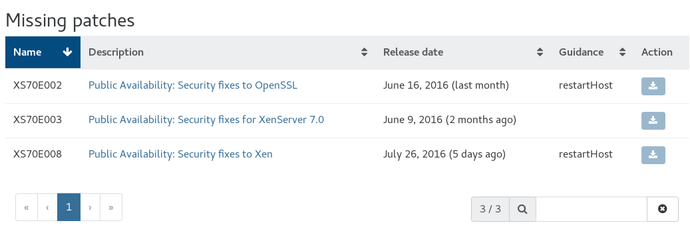

# Patching

Patching a host manually can be time consuming (and boring). That's why we provide the high level feature of downloading and applying all missing patches automatically.

## XOA smart patching system

Your XOA will check the official Citrix servers for missing patches. They will be displayed if any:

* in dashboard view
* in pool view (plus the number of missing patches in a red box)
* in host view (in patching tab, same red pill)

### Installing patches

When you click on "Install all patches", XOA will do all of the following automatically:

* fetch all missing patches from Citrix servers
* unzip them
* upload them
* apply them in the correct order

You can see more screenshots here: https://xen-orchestra.com/blog/hotfix-xs70e004-for-xenserver-7-0/

> If you are behind a proxy, please update your `xo-server` configuration to add a proxy server, as [explained in the appropriate section](configuration.md#proxy-for-xenserver-updates-and-patches).

## Notes on patching

* Xen Orchestra won't reboot your hosts automatically. That's your call to choose when to do it.
* Patching doesn't always require rebooting. Check the "Guidance" row: if "restartHost" is displayed, it means you need to reboot to have the patch fully applied (see screenshot below)
* XO will install all patches without rebooting: that's not an issue. Even applying patches manually, **it's not mandatory to reboot after each patch**.

