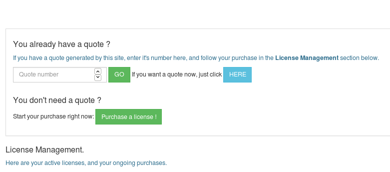
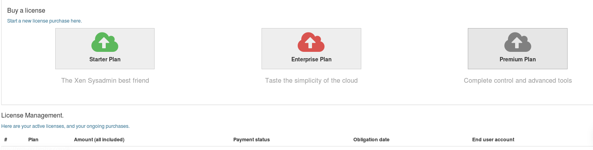
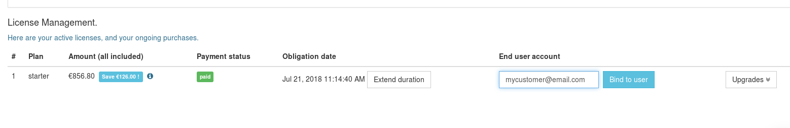

# Selling a Xen Orchestra edition

 You will find in this section all the specification regarding the purchase of Xen Orchestra as a reseller. 
 
### Getting a quote

If you need a quote from us, you can easily have one by getting into your reseller space. 
> note: This quote is integrating the reseller discount, so be sure you are not giving it to your own customer

### First sale process

Your first sale as a XO partner will have a specific condition.
The discount you get on your first sale will be credited on a balance displayed on your partner space. 
* You can use this credit note on the next sale, in addition of the standard discount you normally get
* This discount is usable during 12 month. It means you have to sell more than one Xen Orchestra a year
* This condition only occurs during the first sale. 

### Standard selling process

1. In order to sell Xen Orchestra to one of your customer, you have to go on your [partner space](https://xen-orchestra.com/#!/partner)

> Note: Be sure you are in your **reseller space** and not in your personal space. The personal space is meant to purchase for your own use not for your customers.
On your personal space, you will have no discount. 

2. You can still choose to pay montly or annualy. Once it's done, a new line appears on your reseller space.

4. On this new line, you can upload your wire transfer proof.

3. The last step is to bind the plan to your **final customer** using your customer email.

### Upgrade a plan for you customer

If you want to upgrade a plan for one of your customer, you can do so by clicking on the "upgrade" button on the line corresponding to your customer on the licence management part. 

> Note: The remaining time on the current plan will be used as a credit note when you upgrade.

### From your client perspective

Your client can use the email assigned to register its appliance, and unlock the Edition you purchased. He will not get any invoice from us but can still access to our support system. 
