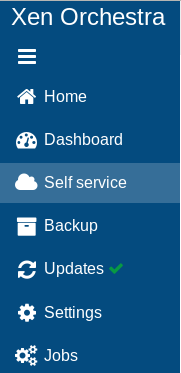

# Self Service

The self-service feature is the possibility for users to create new VMs. That's different from delegating existing resources to them, and it leads to a lot of side-effects.

## Set of resources

To create a new set of resources, go inside the "Self Service" section in the main menu:

### Create a set

> Only an admin can create a set of resources

To allow people creating VMs as they want, we need to give them a *part* of your XenServer resources (disk space, CPUs, RAM). You can call this "general quotas" if you like. But you need first to decide which resources will be used.

In this example below, we'll create a set called **"sandbox"** with:

* "devs" group could access this set (all users in the group)
* "Lab Pool" is the pool where they can play
* "Debian 8 Cloud Ready" is the only template they could use
* "SSD NFS" is the only SR where they can create VMs
* "Pool-wide network with eth0" is the only available network for them

As you can see, only compatible hosts are shown and could be used for this resource set (here, hosts in another pools aren't). This way, you can be sure to have resource free for other task than self-service.

> Don't forget to add an ISO SR to allow your users to install VMs with CD if necessary

#### Quotas

Then, you can define quotas on this set:

* max vCPUs
* max RAM
* max disk usage

> Note: Snapshotting a VM within a self-service will use the quota from the resource set. The same rule applies for backups and replication.  

When you click on create, you can see the resource set and remove or edit it:

## Usage (user side)

As soon a user is inside a resource set, it displays a new button in its main view: "new". 

Now, the user can create a VM with only the resources given in the set:

And the recap before creation:

If the "Create" button is disabled, it means the user requested more resources than available.

Finally, if a user is inside many sets, they can be switched in the top right of the screen.

## Toward the Cloud

Self-service is a major step in the Cloud. Combine it with our [Cloudinit compatible VM creation](cloudinit.md) for a full experience:

* create a Cloud ready template
* create a set and put Cloud templates inside
* delegate this set to a group of users

Now, your authorized users can create VMs with their SSH keys, grow template disks if needed. Everything inside a "sandbox" (the set) you defined earlier!

