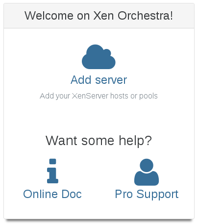
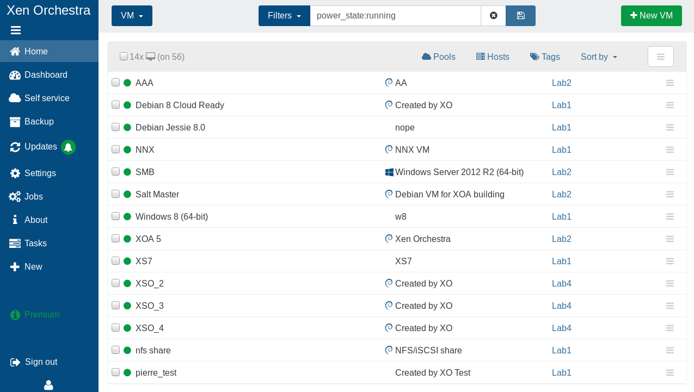

# Home view

This is the home view - what you see when you access your Xen Orchestra URL. It displays all running VMs. This can be configured to your needs (see the "Filters section" below).

If you don't have any servers connected, you'll see a panel telling you to add a server:

## Add a XenServer host

Just click on "Add server", enter the IP of a XenServer host (ideally the pool master if in a pool):

After clicking on connect, the server is displayed as connected:

Now go back to the Home view (or click on the "Xen Orchestra" title on the top left of the screen), you'll see the default home view of VM objects.

## VMs

By default, this view groups all **running VMs** on your connected server:

Let's take a quick tour:

* the global menu is on the left, you can collapse it by clicking on the icon 
* the home view has a header with a type selector (VMs, hosts or pools), a filter zone and a button to create new VMs
* the VM list also has a header (number of filtered VMs and total VMs) and assisted filters (by pool, host and tags) and a sort menu (by name, memory etc.). You can also expand all VMs details here with the icon 

> Pro Tip: you can edit a VM name, description and even current host by long clicking on the field

### Bulk actions

You can select multiple objects (eg VMs) at once to perform a bulk action. The master checkbox will select all, or you can select anything yourself.

After selecting one or more object, an action bar is displayed:

This will execute the action for all selected objects!

## Hosts

All host objects are displayed:

You have power status, name, description, number of CPU cores, total memory, management IP and pool name displayed. You can also edit these by long clicking.

> Pro Tip: If hosts have missing patches, you'll see a red dot with the total patches missing. Click on it to go the patch section of the host. See this blog post on [patches for XenServer](https://xen-orchestra.com/blog/hotfix-xs70e004-for-xenserver-7-0/) for more details.

## Pools

All your pools are displayed here:

You can also see missing patches in red.

> Did you know? Even a single XenServer host is inside a pool!
