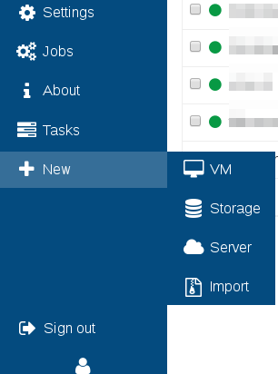

# VM import and export

Xen Orchestra can import and export VM's in XVA format (XenServer format) or import OVA files (OVF1 format).

> We support OVA import from VirtualBox. Feel free to report issues with OVA from other virtualization platforms.

## Import

### XVA files

To import an XVA file, just go to the New/Import menu:

Select the target pool and SR where the VM will be imported. Then, drag and drop your file and click on the import button.

### OVA files

OVA files contains extra info that you need to check before importing, like name, etc.

When you are OK with these settings, just click on the "Import" button.

## Export

> Exported VMs are in XVA format

Just access the page for the VM that you want to export, and click on the "Export" button in the toolbar. You'll instantly download a compressed XVA file.

It works even if the VM is running, because we'll automatically export a snapshot of this VM.

### Snapshot export

In the VM "Snapshots" tab, you can also export a snapshot like you export a VM.
