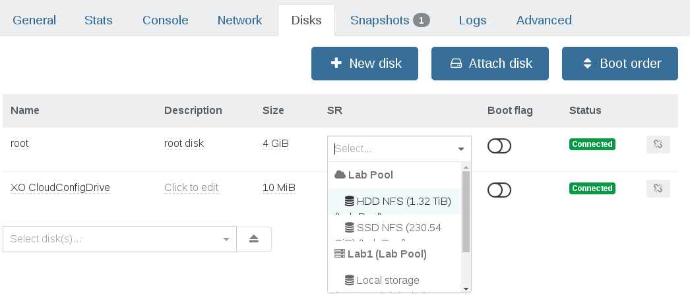

# VM management

## Live Editing

Any object with a dotted underline can be edited with a mouse click: VM title, description, CPU and memory.

In the advanced tab, you have extra options:

### XenServer limitations

* Each VM has a maximum vCPU number. This value can't be changed while the VM is running. You can reduce the number of vCPUs, but you can't assign more than the set max. In XO, while your VM is halted, set the max vCPUs you would need, then boot it. Now you can reduce it and then expand it later to this maximum.
* The same limitation applies to static RAM.

You can learn more about XenServer [resource management on the Citrix Website](https://docs.citrix.com/de-de/xencenter/6-5/xs-xc-vms-configuring/xs-xc-vms-memory/xs-xc-dmc-about.html).

## VDI live migration

Thanks to Xen Storage Motion, it's easy to move a VM disk from one storage location to another, while the VM is running! This feature can help you migrate from your local storage to a SAN, or just upgrade your SAN without any downtime.

To do so: Access the Xen Orchestra page for your running VM, then enter the Disk tab. Long click on the current SR of the disk, and a drop down menu will be displayed with all compatible destinations. Just select one, that's all: the migration will start live!

### Offline VDI migration

Even though it's not currently supported in XenServer, we can do it in Xen Orchestra. It's exactly the same process as a running VM.

## VM recovery

In the advanced tab, use the "Recovery Start" button:

This button will allow you to boot directly from the CD drive, ignoring your current disks. Note that it works for all virtualization modes: HVM or PV.

## Auto power VM

Activating "Auto Power on" for a VM will also configure the pool accordingly. If your host is rebooted, the VM will be started right after the host is up.

## VM high availability (HA)

If you pool supports HA (must have shared storage), you can activate "HA". Read our blog post for more details on [VM high availability with XenServer](https://xen-orchestra.com/blog/xenserver-and-vm-high-availability/).

### Docker management

> Please [read the dedicated section](docker_support.md) to install a Docker Ready VM.

### VM CPU priority

You can change the CPU Weight in the VM advanced view. The values are:

* Default
* Quarter (64)
* Half (128)
* Normal (256)
* Double (512)

By default, each VM has a weight of 256.

If one VM has for example, "Double", it will have double the priority on the Xen scheduler. [Read more on the official Citrix XenServer documentation](http://support.citrix.com/article/CTX117960).

### VM Copy

VM copy allows you to make an export and an import via streaming. You can target any SR in your whole XenServer infrastructure (even across different pools!)

### Snapshot management

You can create a snapshot with one click. It will be named automatically. After the snapshot is created, you can either:

* export it on your computer
* revert your VM to this snapshot (it will restart the VM)
* delete this snapshot

> By default, XOA will try to make a snapshot with quiesce. If the VM does not support it, it will fallback to the default snapshot system.
