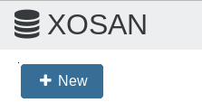

XOSAN is a 100% software defined solution for XenServer hyperconvergence. If you are curious about it, you have to possibility to get a free 50GB cluster to play with a discover all the benefits you can get by using XOSAN in your infrastructure. 

## Step 1 

SSH in your XenServer and use the command line `bash -c "$(curl -s http://xoa.io/deploy)"` - it will deploy Xen Orchestra Appliance on your XenServer infrastructure which is required to use XOSAN.

## Step 2

Register your XOA appliance
> *If you are not familiar with Xen Orchestra, note that you can also activate a 15 days Premium trial for XOA.*

## Step 3

Access the XOSAN menu and click on the "new" button. By default, your XOSAN will be a trial license, limited to 50GB of space. 

> *You will always have the opportunity to upgrade an existing XOSAN cluster which is in trial version to a standard XOSAN license.* 
